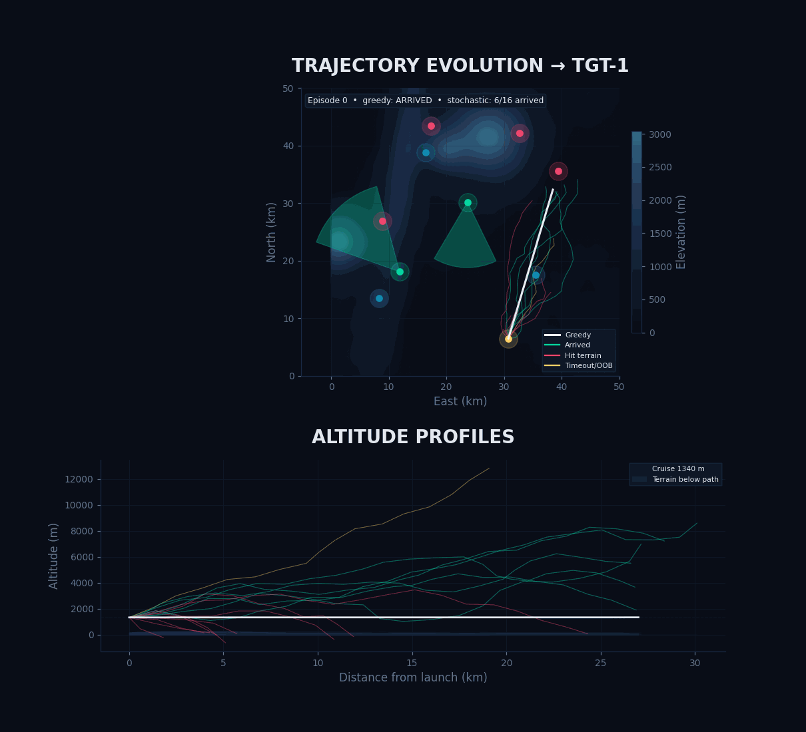

# Invex

Missile trajectory simulation, prediction, and interception platform.

The long-term goal is an adversarial reinforcement-learning framework where a launcher agent and an interceptor agent compete against each other over procedurally generated terrain.

## Trajectory evolution (RL training)



Each frame is a generation snapshot. **White line** = greedy policy. **Cyan** = arrived, **magenta** = hit terrain, **amber** = timeout. The bottom panel shows the altitude profile of every path in that generation — early frames show chaotic 0–8000 m spread; later frames converge to a tight terrain-avoiding corridor.

## Roadmap

| Phase | Status | Description |
|---|---|---|
| Terrain & physics | ✅ Done | Procedural terrain, ENU physics, drag, gravity |
| RL navigation | ✅ Done | REINFORCE agent navigates missiles to targets while avoiding terrain |
| Trajectory prediction | 🔲 Planned | Infer launch origin and destination from partial sensor observations |
| Interceptor design | 🔲 Planned | Optimize interceptor missiles to neutralize threats |
| Adversarial RL | 🔲 Planned | Launcher vs interceptor competing agents |

## Project structure

| File | Description |
|---|---|
| `terrain.py` | Procedural terrain generation (Gaussian mountains, ridges, fractal noise), site placement, sensor/radar placement with sweeping detection cones, line-of-sight queries, 2D/3D visualization |
| `trajectory.py` | Missile physics — gravity, drag, g-force limits, Euler integration (ENU, SI units) |
| `nav_env.py` | Gym-style RL environment — 24-D observation (position, velocity, terrain fan probes), 3-D acceleration action, reward shaping |
| `nav_agent.py` | REINFORCE agent with Gaussian policy, value-function baseline, proportional-navigation warm start |
| `train_nav.py` | Training loop, generation snapshot collection, plots and GIF export |
| `scheme.py` | Centralized visual theme — colour palette, typography, glow effects |

## How the navigation RL works

The missile starts from a fixed launch site and must reach a target waypoint while staying above terrain.

**Observation (24-D):**
- `[0:3]` normalised position
- `[3:6]` normalised velocity
- `[6:9]` vector to target
- `[9]` terrain clearance at current position
- `[10:17]` fan terrain probes (7 angles: −90° → +90° at 10 s look-ahead)
- `[17:20]` straight-ahead probes at 3 s, 8 s, 20 s
- `[20]` current speed
- `[21:24]` unit vector to target

**Action (3-D):** desired acceleration `[ax, ay, az]` ∈ [−1, 1], scaled by `max_g × g`.

**Policy:** proportional-navigation baseline (fly toward target, cancel gravity) plus a learned RL correction. The network only needs to learn *when and how much to deviate* for terrain avoidance.

**Reward:** +100 arrival, −100 terrain/ceiling/OOB, +10 × lateral progress, quadratic terrain-clearance penalty below 250 m, −0.02 time penalty per step.

## Key concepts

- **Terrain** — 50 × 50 km elevation grid with Gaussian mountains, ridges, and fractal noise. Launch site in the south, targets in the north.
- **Sensors** — Short-range pulsing sweep detectors with narrow rotating beams. Only detect objects above terrain.
- **Radars** — Long-range, slow-sweep detectors with wider beams.
- **Coordinate system** — Right-handed ENU: x = east, y = north, z = up. SI units throughout.

## Setup

```bash
pip install -r requirements.txt
```

Dependencies: `numpy`, `matplotlib`

## Training

```bash
# Train for 10 000 episodes on TGT-3 (hardest — blocked by terrain)
python train_nav.py --episodes 10000 --target 2

# Custom run
python train_nav.py --episodes 5000 --batch-size 32 --snapshot-every 200 --seed 42 --target 0
```

Outputs saved to the project root:

| File | Description |
|---|---|
| `nav_generations.gif` | Animated trajectory evolution across training generations |
| `nav_generations.png` | All generation paths overlaid (static) |
| `nav_training.png` | Reward and arrival-rate curves |
| `nav_missions.png` | Final trained policy on all 4 targets |
| `nav_altitude.png` | Altitude profile for the snapshot target |

## Development

```bash
python -m pytest tests/
```

## License

Private.
